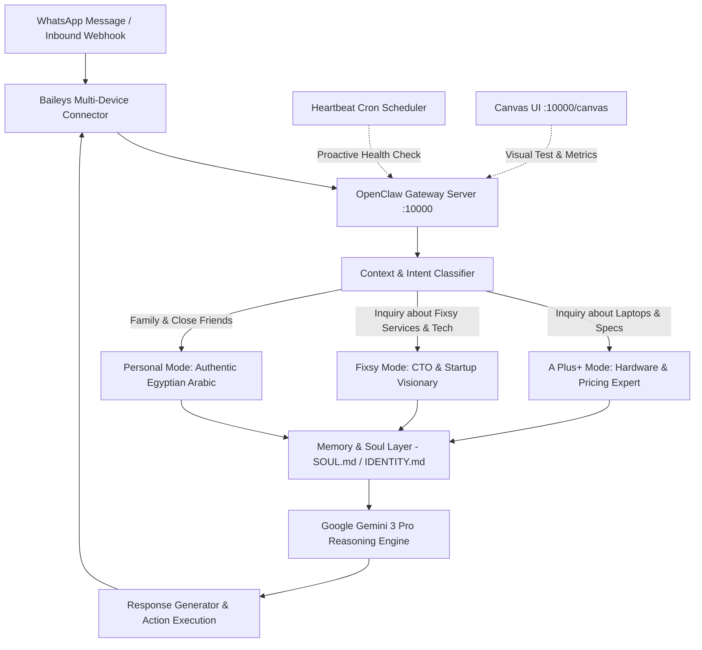

<div align="center">

# 🤖 Zain's AI Chief of Staff & Autonomous Digital Twin

**A production-ready Autonomous AI Agent and Personal Digital Twin acting as the executive gatekeeper, business assistant, and CTO delegate for Zain (Mohamed Saad).**

Built with **OpenClaw Engine**, **Google Gemini 3 Pro**, and **Baileys WhatsApp Multi-Device Protocol**.

---

[](https://nodejs.org)
[](https://openclaw.ai)
[](https://ai.google.dev)
[](https://github.com/WhiskeySockets/Baileys)
[](LICENSE)

</div>

---

## 🎯 Overview

**Zain-Agent** is not a generic chatbot. It is a full **Digital Twin** and **AI Chief of Staff** designed to represent, gatekeep, and execute operational workflows on behalf of **Zain (Mohamed Saad)**:
- **Founder & CTO** of [Fixsy](https://github.com/zvinn/fixsy-app) (On-demand home maintenance startup).
- **Owner & Hardware Lead** of [A Plus+](https://github.com/zvinn/a-plus-laptops) (Premium workstation & gaming laptop retail).

The agent lives directly on WhatsApp, triaging communications, protecting founder focus, answering technical inquiries, and scheduling automated tasks.

---

## 🧠 Core Architecture & Capabilities



### 1. Context-Aware Personality Switching
* **A Plus+ Owner Mode**: Speaks with deep hardware authority (Dell Precision, ThinkPad workstations, GPUs, thermals, warranty policies, and pricing).
* **Fixsy CTO Mode**: High-level technical and operational perspective, discussing platform architecture, contractor vetting, and service workflows.
* **Authentic Egyptian Persona**: Avoids robotic corporate jargon ("كيف يمكنني مساعدتك يا سيدي؟"). Communicates naturally with sharp, concise Egyptian phrasing, preserving Zain's real voice.

### 2. Autonomous Soul & Behavioral Guardrails (`SOUL.md`)
* **Resourceful Before Asking**: Reads context, inspects memory, and reasons before requesting clarification.
* **Ruthless Gatekeeping**: Filters time-wasters and low-priority solicitations politely but firmly to protect executive bandwidth.
* **Strict Privacy Boundaries**: Private conversations and business financials remain strictly guarded.
* **Persistent Memory**: Evaluates continuous context across sessions through persistent markdown memory files.

### 3. Automated Scheduling & Proactive Heartbeat
* Built-in **Cron engine** for scheduled automated tasks and notifications.
* **Heartbeat loop** (`HEARTBEAT.md`) for intermittent background checks without needing human initiation.

### 4. Interactive Canvas UI
* Embedded web-based interactive canvas (`clawd/canvas/index.html`) served directly over the gateway for live debugging, telemetry, and visual outputs.

---

## 📂 Project Structure

```bash
Zain-Agent/
├── clawd/                         # Agent Workspace & Memory
│   ├── IDENTITY.md                # Persona, bio, dual-context rules, voice tone
│   ├── SOUL.md                    # Core operating principles & autonomy guardrails
│   ├── USER.md                    # User background and contextual preferences
│   ├── TOOLS.md                   # Environment-specific configuration & tool notes
│   ├── HEARTBEAT.md               # Periodic automated heartbeat task queue
│   ├── AGENTS.md                  # Subagent roles and tool permissions
│   └── canvas/                    # Interactive visual canvas
│       └── index.html
├── clawdbot.example.json          # Example OpenClaw agent & model configuration
├── .env.example                   # Template environment variables
├── .gitignore                     # Strict exclusion of sessions & credentials
├── package.json                   # Project metadata and gateway scripts
└── README.md                      # Complete system documentation
```

---

## 🚀 Getting Started

### Prerequisites
* **Node.js**: `>= 20.0.0`
* **OpenClaw CLI**: `@openclaw/cli` / `clawdbot`
* **Google Antigravity / Gemini API Key**

### 1. Installation
```bash
git clone https://github.com/zvinn/zain-agent.git
cd zain-agent
npm install
```

### 2. Configuration
Copy the environment template and configure your keys:
```bash
cp .env.example .env
cp clawdbot.example.json .clawdbot/clawdbot.json
```

Set your primary LLM and credentials in `.env`:
```env
GATEWAY_PORT=10000
GATEWAY_HOST=0.0.0.0
GEMINI_API_KEY=your_gemini_api_key_here
```

### 3. Launching the Gateway
Start the OpenClaw agent gateway:
```bash
npm start
```
The gateway will boot on port `10000`. Scan the terminal QR code using WhatsApp on your primary or linked device to activate the live multi-device session.

---

## 🔒 Security & Privacy Notice

> [!IMPORTANT]
> This repository strictly excludes all live session keys, pairing data (`.clawdbot/credentials/`), and conversation histories (`.clawdbot/agents/*/sessions/`). Never commit `.env` or sensitive session files to any public repository.

---

## 👨‍💻 Author

**Zain (Mohamed Saad)**
* GitHub: [@zvinn](https://github.com/zvinn)
* Role: Full-Stack Engineer & AI Systems Builder
* Startups: [Fixsy](https://github.com/zvinn/fixsy-app) | [A Plus+](https://github.com/zvinn/a-plus-laptops)

---

<div align="center">
<i>Built with passion in Cairo, Egypt 🇪🇬</i>
</div>
